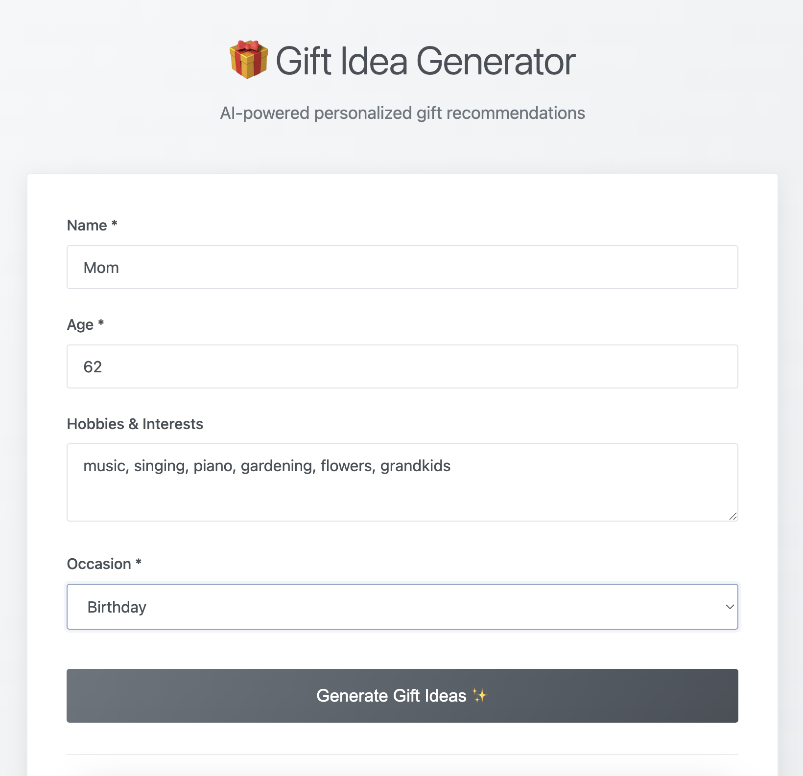

# 🎁 Gift Idea Generator

An AI-powered web application that generates personalized gift recommendations using Ollama's local language models. Simply input details about the gift recipient, and get thoughtful, ranked gift suggestions with reasoning.

## Features

- **Personalized Recommendations**: AI analyzes recipient's age, interests, and occasion
- **Local AI Processing**: Uses Ollama for privacy-focused, local AI inference
- **Clean, Modern UI**: Minimalist design with smooth interactions
- **Real-time Generation**: Instant gift suggestions with fit scores

## Screenshots

### Main Interface


### Gift Ideas Results


## REST Endpoints

Name & Description             | Method | Path
-------------------------------|--------|------------------------------------
Generate personalized gift recommendations | POST   | /generate-gifts

### Example Request

```json
{
  "name": "Sarah",
  "age": 28,
  "hobbies": "reading, hiking, photography",
  "occasion": "birthday"
}
```

### Example Response

```json
{
  "success": true,
  "input": { "name": "Sarah", "age": 28, "hobbies": "reading, hiking, photography", "occasion": "birthday" },
  "gifts": [
    {
      "name": "Gift Name",
      "description": "Brief description of the gift",
      "fit_score": 95,
      "reasoning": "Why this is a good fit"
    }
  ]
}
```

## Setup

1. Install dependencies: `npm install`
2. Start the server: `node server.js`
3. Open `client/index.html` in your browser

## Technologies

- **Backend**: Node.js, Express, Ollama JavaScript library
- **Frontend**: Vanilla JavaScript, HTML5, CSS3
- **AI**: Ollama with GPT-OSS model

